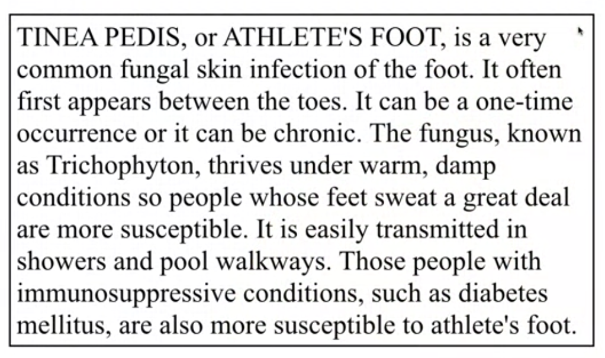

==== Metin Sınıflandırılması ====

Bu modülde, metin sınıflandırması veya denetimli metin öğrenme hakkında konuşacağız.
Vakayı başlatmak ve kurmak için bu paragrafa bakalım. Tıbbi bir belge hakkındadır.

Ve bunun ilgili olduğu uzmanlık hakkında düşünmenizi istiyorum.
 Nefroloji mi, nöroloji mi yoksa podiatri mi? Kelimelere baktığınızda,
ayak bilincinin olduğunu düşünürdünüz, çünkü orada ayaklarınız var,
mantar enfeksiyonu ve deri enfeksiyonu ile bir ilginiz var, vb. Ve,
nefroloji, beyinle ilgili böbrek veya nöroloji bilimi, Bu ayakla ilgili
çalışmalarla daha yakından ilgili, yani podiatri bu, değil mi?
Şimdi, sahip olduğunuz üç sınıfa, yani nefroloji, nöroloji ve podiatri
verildiğinde, başka bir paragrafa bakalım. Burada böbrek yetmezliğinden
bahsettiğini göreceksiniz.

......
